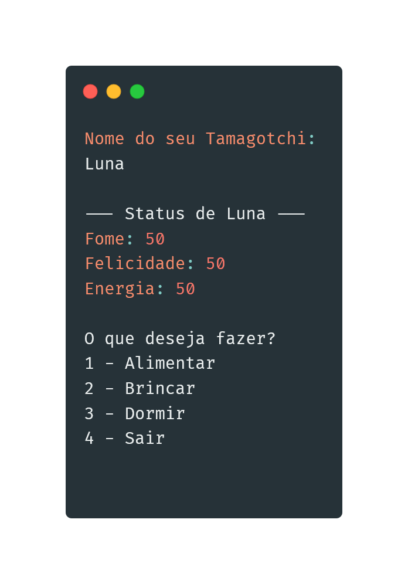

# 🐾 Tamagotchi em Java

Simulação de bichinho virtual em Java (console), utilizando conceitos de Programação Orientada a Objetos.  
O usuário pode alimentar, brincar e colocar o pet para dormir, monitorando seus níveis de **fome**, **felicidade** e **energia**.

Projeto criado para construção e fixação de habilidades em programação orientada a objetos, clean-coding e raciocínio lógico.

---

## 🚀 Funcionalidades

✔ Criar um Tamagotchi e escolher seu nome
✔ Mostrar status
✔ Alimentar (reduz fome, gasta energia, aumenta felicidade)
✔ Brincar (aumenta felicidade, mas cansa e dá fome)
✔ Dormir (recupera energia, mas fica com fome e triste)
✔ O pet pode **morrer** se ficar com muita fome, muito triste ou cansado

---

## 💻 Tecnologias

- Java, maven
- Programação Orientada a Objetos (POO)
- Scanner (entrada pelo console)

---

## 📂 Executar

- >java App.java

## 📸 Exemplo de uso

